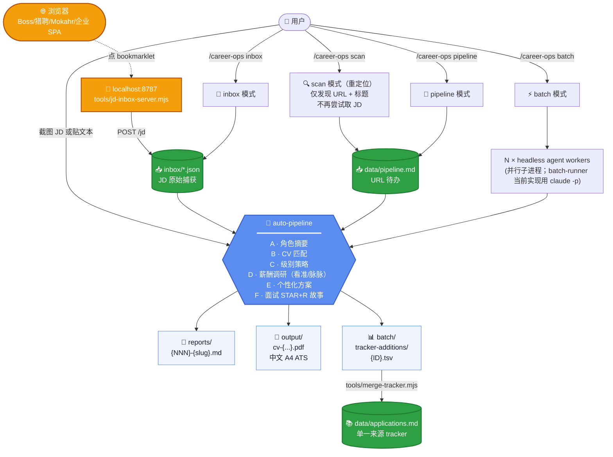
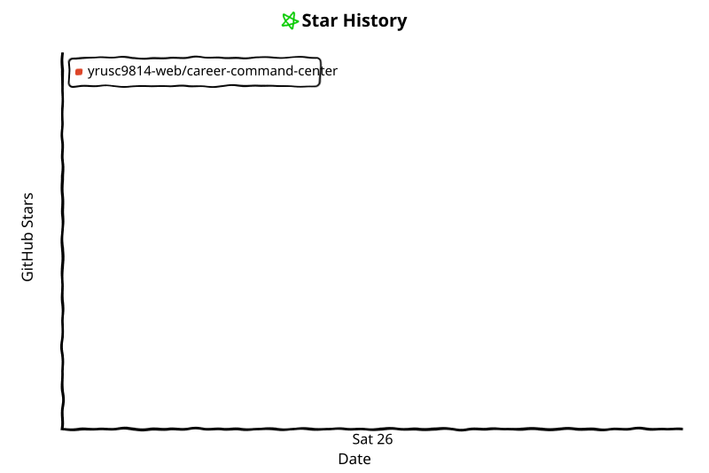

# Career Command Center

> **Agent-neutral 中国大陆求职指挥中心**

**Product name:** Career Command Center · **Skill / command namespace:** `career-ops`

Career Command Center 是一套 **Agent-neutral** 的中国大陆求职工作流。它不绑定 Claude、Codex、Kimi 或某一个具体 Agent：

- **Agent 是运行宿主** — 负责理解你的指令、读取项目文件、调用本地工具
- **模型负责理解和执行** — 各宿主接入的模型按各自的数据处理方式工作
- **本地工具负责确定性处理** — 评分、匹配、持久化、报告都由 `tools/lib/` 运行时引擎产出
- **浏览器控制是可选 capability** — 有就用 browser-search 自动采集，没有就走截图 / bookmarklet

核心能力：JD 采集 → CV Match（0-100）→ Career Score（0-100）→ Eligibility → Recommendation（五档 + decision trace）→ 评估报告 → Dashboard → 申请 tracker → 定制 CV PDF → 薪酬调研 → 面试题库 / Story Bank → 触达消息草稿。

> **起源说明（历史 / 致谢）：** 本仓库是 [`santifer/career-ops`](https://github.com/santifer/career-ops) 的中国大陆求职市场深度定制 fork（开发历史上曾用名 career-ops-china），预置方向为中国大陆采购从业者（执行采购 / 寻源与供应商开发 / 战略与品类采购）。核心改动包括：
>
> - **17 个 mode 文件** 全部翻译为中文，按国内招聘流程重写（含新增 `inbox` / `browser-search` mode）
> - **3 个采购 archetype**（执行采购 / 寻源与供应商开发 / 战略与品类采购）+ 采购六档职级序列（助理 / 专员 / 高级专员 / 主管 / 经理 / 总监·负责人）
> - **四层决策架构**：Eligibility / Blocker → CV Match（0-100）→ Career Score（0-100，十维 × 权重 100）→ Recommendation（五档 + decision trace），全部由运行时引擎（`tools/lib/`）产出
> - **薪酬调研源** 从 Glassdoor / Levels.fyi / Blind 切换到 **看准网 / 脉脉 / OfferShow / 知乎 / 职友集 / 猎聘**
> - **公司调研源** 改用 脉脉职言区 / 天眼查 / 企查查 / 招投标公告 / 行业媒体 / 小红书
> - **🔑 Bookmarklet + Local Inbox 工作流**：在浏览器里点一次书签，把你已经打开的 JD 页面结构化捕获到本地 inbox，供你的 AI Agent 后续批量分析。这是国内登录墙平台 JD 取数的**默认推荐路径**（最低自动化依赖）
> - **门户处理范式**：默认走 **截图 / bookmarklet** 人机协作；自动化爬取仅作为**可选**的 browser-search 路线（Playwright / WebFetch 只用于企业自有静态招聘页 + V2EX + GitHub）
> - **企业池模板**：按目标品类自填（制造 / 贸易品牌 / 零售消费 / 供应链服务 / 外企在华），预置匿名占位与使用指引
> - **触达模式** 从 LinkedIn 改为 脉脉 + 微信 双轨
> - **CV 模板** 加入中文字体回退（PingFang SC / Microsoft YaHei / Noto Sans SC）
> - **硬红线机制** 直接 SKIP 不接受的公司类型（用户可定义如派遣外包 / 大小周），含 **HR 派遣公司识别**
> - **面试体系**：15 主题 × 4 职级采购面试题库（`modes/interview-questions.md`）+ Story Bank 18 类采购故事
>
> 原版 [`santifer/career-ops`](https://github.com/santifer/career-ops) 在 MIT License 下保留所有版权 — 见 [LICENSE](LICENSE)。

---

## Agent / Host Compatibility（不绑定单一 Agent）

**Career Command Center 不绑定单一模型或 Agent Host。** 它的核心由 Markdown workflow、deterministic local runtime、local configuration、local tools 和 Dashboard 组成；任何能满足下面能力要求的 Agent 都可以作为宿主运行这套工作流。

### 基础能力要求（必需）

一个宿主只要能：

1. 读取项目文件
2. 理解 Markdown / project instructions（读 `AGENTS.md` 入口）
3. 修改允许修改的本地文件
4. 执行 Node.js / npm 命令（需要工具功能时）

就可以运行核心工作流（评估、评分、报告、tracker、PDF）。

### 可选能力

5. 浏览器控制 — 有则可用 `browser-search` 自动采集；没有就走截图 / 粘贴 / bookmarklet
6. Web 搜索 — 薪酬调研与线索发现用
7. 文件上传 / 截图读取 — 截图 JD 评估用

不同宿主提供的能力组合不同：没有 browser capability 仍可截图 / 粘贴 JD / 用 bookmarklet；没有 Agent Skill 机制的宿主可以直接读 `AGENTS.md` 和 `modes/*.md`；有 browser control 的宿主才建议选择 `browser-search`。

### 宿主示例

| 类别 | 宿主 | 说明 |
|------|------|------|
| **已实际验证（verified）** | **ZCode** | 当前项目持续真实开发与使用的环境 |
| **兼容入口（compatibility entry）** | **Claude Code** | 仓库保留 `.claude/skills/career-ops/SKILL.md` 与 `CLAUDE.md` 作为 Claude Code 兼容入口；提供入口 ≠ 全部能力已在该宿主完成 E2E 验证 |
| **兼容宿主示例（compatible examples）** | OpenAI Codex、Cursor、WorkBuddy、千问办公、DIM、Qoder | 以及其他能够读取项目文件 / 项目级规则 / 调用本地命令的 Agent |

> **Compatibility disclaimer：** 上表是兼容宿主示例，不代表每个功能都已在每个宿主上完成完整 E2E 验证。兼容性取决于各宿主实际提供的文件、终端、浏览器和工具能力。除非显式标注 verified，列入列表不等于官方完整支持。
>
> These are compatibility examples, not a claim that every feature has been fully E2E-tested on every host. Compatibility depends on each host's available file, terminal, browser, and tool capabilities. Unless explicitly marked as verified, inclusion in this list does not mean every feature has completed full E2E validation on that host.

## Career Domain Customization（求职方向可定制）

注意区分两件不同的事：**Agent 宿主是通用的**（见上节），**职业方向预置是可定制但非开箱通用的**。

当前默认 preset（taxonomy、archetype、评分维度、portals 词表）**明显偏中国大陆采购 / 供应链方向**：A-F 评估、CV 匹配、薪酬调研、tracker 入库、PDF 生成、bookmarklet inbox 这些流程本身与具体岗位无关，但预置词表、职级序列与评分维度都是采购视角。其他职业方向需要调整 archetype / taxonomy / scoring configuration 或 runtime rules — 本轮预置不做这些调整，仅如实说明。

| 你想做什么方向 | 让你的 Agent 改 |
|----------------|--------------|
| 销售 / 市场 / 客户成功 | `modes/_profile.md` 的 archetype 表 + `portals.yml` 的 title_filter + tracked_companies |
| 供应链计划 / 物流 / 仓储 | 同上 + 调整排除词（把"计划员/物流"从 negative 移到 positive） |
| 质量 / SQE / 生产管理 | archetype 替换 + 评估维度权重调整（采购自主权 → 质量体系） |
| 财务 / HR / 法务 | 重写 archetype + 评估维度从"品类与行业价值"换成对应职能价值 |
| 海外岗（任何方向）| 改用上游 [`santifer/career-ops`](https://github.com/santifer/career-ops)（薪酬源用 Glassdoor/Levels.fyi 而非看准网） |
| 其他冷门方向（医疗 / 教育 / 制造业其他序列）| 直接向你的 Agent 描述方向，让它重写 archetypes + 数据源 + framing |

**操作只需一句话**：告诉你的 Agent"我是 [方向] 的，请把整个系统调整到这个方向"，它会改 `_profile.md`（archetype + 叙事）/ `profile.yml` / `portals.yml` / `cv-template.html` 等所有相关文件。

> 设计哲学：**文件即配置，Agent 即编辑器**。预置只是起点，不是边界 — 但其他方向的适配程度取决于你调整的深度，不是开箱即用。

---

## 这个项目是什么

**Career Command Center 把你的 AI Agent（无论哪种宿主）变成一个中国大陆求职指挥中心**：贴一个岗位 JD 进来，AI 会自动跑完整 6 块评估（A-F），生成针对该岗位的 ATS 优化简历 PDF，把申请入库追踪。再加上薪资调研、面试题库与故事库、谈判话术、批量扫描、申请表助手、脉脉/微信 触达消息生成等十几个独立 mode。

> ⚠️ **这不是海投工具，是过滤器**。系统对 < 75/100 分的岗位会强烈不建议申请。所有动作的最后一步永远是用户决定是否提交。

### 适合谁

⚠️注意：求职方向仅供参考，你可以自己更改或者系统会根据你 cv.md 里的经历和技能自动检测 archetype，如果 JD 对齐度高但不完全匹配预置 archetype，也会给出合理的评估和建议。

- **求职方向**：采购序列 — 执行采购 / 寻源与供应商开发 / 战略与品类采购
- **典型行业**：制造（机械 / 汽车零部件 / 电子）/ 贸易与品牌商 / 零售与消费 / 供应链服务 / 外企在华采购办
- **目标 base**：北京 / 上海 / 深圳 / 苏州 / 宁波 / 厦门 等（其他城市也可，门户预置覆盖全国主流门户）
- **目标公司**：制造 / 贸易 / 零售企业 + 供应链服务公司（按目标品类自填企业池）

### 不适合谁

- 想海投上千家公司碰运气 — 系统会引导你减少投递、提升匹配度
- 想找海外岗位 — 用上游 [`santifer/career-ops`](https://github.com/santifer/career-ops) 更合适

---

## 它的工作原理



### A-F 六块评估（核心）

每个 JD 进来都会跑 6 个 block：

| Block | 内容 | 配置位置 |
|------|------|---------|
| **A 角色摘要** | Archetype、Domain、Categories、Tags、Seniority（采购六档）、业务方向、Base 城市、TL;DR | `_profile.md`（archetype 列表）+ `tools/lib/taxonomy.mjs` |
| **B CV 匹配** | JD 每条要求 → 候选人 cv.md 对应行；Gap 四级（BLOCKER / HARD_GAP / SOFT_GAP / UNKNOWN）+ 类型 + 缓解策略；Capability Coverage 表 | `_profile.md` + `tools/lib/cv-match.mjs` / `evidence.mjs` |
| **C 级别策略** | JD 暗示级别 vs 候选人自然级别（采购六档序列）；「不撒谎卖资深」/「被压级」两套话术 | `_shared.md` 采购职级序列 |
| **D 薪酬与需求** | **看准网/脉脉/OfferShow/知乎/职友集** 调研薪资段、口碑、工时、业务前景 | `_shared.md` 数据源列表 |
| **E 个性化方案** | Top 5 CV 修改 + Top 5 LinkedIn/脉脉资料修改（围绕采购量化证据） | `offer.md` Block E 证据清单 |
| **F 面试准备** | 6-10 个 STAR+R 故事（Story Bank 18 类）+ 主讲 case + 红线问题预演；题目按 `modes/interview-questions.md`（15 主题 × 4 职级）选 | `modes/interview-questions.md` |

### 3 个采购 archetype（预置，可改）

| Archetype | 主题轴 | 公司在买什么 |
|---|---|---|
| **执行采购 / execution_procurement** | 询比价执行、下单、跟单、催交、对账、交货及时率 | 把订单闭环做稳、供应不断档的人 |
| **寻源与供应商开发 / sourcing** | 新供应商开发、RFQ、筛选、比价、谈判、导入 | 能持续找到并导入更优供应商的人 |
| **战略与品类采购 / strategic_category** | 品类策略、年度降本、Should-cost、供应商组合 | 管好一个品类的总成本与供应结构的人 |

> 判定规则：只看职责动词分布，title 不进判定；证据不足 → unknown 禁止硬套。权威 signal 词表：`tools/lib/taxonomy.mjs`。

### 评分与决策（四层架构，全部由运行时引擎产出）

| 层 | 输出 | 实现 |
|----|------|------|
| **Eligibility / Blocker** | `eligibility_status`（eligible / eligible_with_gaps / ineligible / unknown）+ hard_requirements[] + candidate-side blocker | `tools/lib/eligibility.mjs` |
| **CV Match** | `cv_match_score` 0-100（14 因子：Primary 55 / Secondary 30 / Low 15）+ confidence | `tools/lib/cv-match.mjs` |
| **Career Score** | `career_ops_score` 0-100（十维 × 权重 100，unknown 不入分母；Round 1 起为 0-100 制）+ confidence | `tools/lib/scoring.mjs` |
| **Recommendation** | 五档（强烈推荐 / 推荐 / 一般 / 不推荐 / 硬红线跳过）= 决策矩阵 + 硬红线 + blocker + 缺口封顶，附 `trace[]` | `tools/lib/scoring.mjs` `computeRecommendation` |

十维维度表（key / 中文名 / 权重，1/3/5 细则见 `tools/lib/scoring.mjs` 的 `SCORING_RUBRIC`）：

| key | 维度 | 权重 |
|-----|------|-----:|
| compensation | 薪酬竞争力 | 20 |
| workload_workstyle | 工作制与强度 | 15 |
| role_seniority | 职级质量与职责范围 | 13 |
| career_growth | 成长空间 | 10 |
| category_domain_value | 品类与行业价值 | 10 |
| procurement_ownership | 采购自主权 | 9 |
| company_stability | 公司与业务稳定性 | 7 |
| location_fit | 地点与通勤 | 8 |
| digital_tooling | 数字化与工具成熟度 | 5 |
| hiring_process_quality | 招聘流程质量 | 3 |

> 三列独立：CV Match（0-100）回答"履历与岗位多匹配"；Career Score（0-100）回答"岗位本身的职业价值"；Recommendation 是决策结论。**三列不可加权合成一个总分**，高分不推荐是合法状态（decision trace 是唯一解释依据）。

### 硬红线机制（你定义，系统执行）

在 `config/profile.yml` 里写下你不接受的公司类型，系统在评估前直接判 SKIP：

```yaml
deal_breakers:
  - "外包 / 派遣 / 劳务外包岗位"
  - "大小周"
  - "纯跟单员 / 仓储物流岗（非采购职能）"
```

每次 scan / 评估都会先检查红线，命中直接跳过不浪费精力。

### JD 采集的三条路线（JD Acquisition Paths）

国内门户和西方差异巨大（强反爬 + 登录墙 + SPA + 滑块），系统针对不同情况提供三条路线。**三条路线是并列关系，不是互斥关系**：

| 路线 | 适用场景 | 依赖 |
|------|---------|------|
| **A. Manual Capture（手动捕获，默认、最通用）** | 截图 JD / 粘贴 JD 文本 / 用户提供公开 URL | 最低自动化依赖；登录态复杂平台（Boss / 脉脉）最稳妥 |
| **B. Local Bookmarklet（本地书签捕获）** | 用户在浏览器打开 JD → 点 bookmarklet → `localhost:8787` → inbox | 只需本地服务器；用户主动触发 |
| **C. Optional Browser Automation（可选浏览器自动化 = `browser-search` mode）** | 宿主具备真实浏览器控制能力时，只读搜索 / 采集 | 非默认路径；可能触发平台风控，遇验证立即 STOP |

各平台的典型表现：

| 平台 | 问题 | 推荐路线 |
|------|------|---------|
| **V2EX 招聘 / GitHub README / 企业自有静态招聘页** | 公开无限制 | A（直接提供 URL）或 C |
| **企业自有招聘 SPA**（制造 / 贸易 / 零售集团 careers） | JD 详情页 SPA 空壳 | ⚡ **B bookmarklet 主路径**（`tools/bookmarklets/dachang-spa.js`），或 A 截图 |
| **电商 / 新消费 / 供应链服务企业招聘**（多走 Mokahr / 飞书表单） | Mokahr iframe / 飞书表单 | ⚡ **B bookmarklet**（`mokahr.js`）或 A 截图 |
| **Boss 直聘 / 拉勾 / 猎聘** | 强反爬 + 滑块 + 登录墙 + 反复制 | ⚡ **B bookmarklet 专用版本**（`boss-zhipin.js` / `liepin.js` / `lagou.js`，解除当前页面反复制样式后结构化抽取），或 A 截图 |
| **脉脉招聘 / LinkedIn / 微信公众号** | 必须登录 / DOM 加密 | 📸 A 用户截图给 Agent |

> **设计范式：** 对国内强反爬平台，**默认推荐 A / B 两条人机协作路线** — 自动化爬取在这类平台上通常不稳定（受登录墙、SPA、验证码、平台策略影响）。`scan` mode 只做线索发现（URL + 标题）；`browser-search` 是独立、可选、用户显式调用的浏览器自动化路线，需要宿主具备 browser-control capability 且带风控熔断。**`scan` 不等于 `browser-search`。**
>
> 详见 [`tools/README.md`](tools/README.md) 与 [`modes/browser-search.md`](modes/browser-search.md)。

---

## 这个 fork 和原版的 14 个核心区别

| # | 区别 | 文件 |
|---|------|------|
| 1 | 3 个采购 archetype（执行 / 寻源 / 品类）+ 六档采购职级序列 | `modes/_profile.template.md`, `modes/_shared.md` |
| 2 | A-F 评估流程全中文重写，加入国内 HR 红线问题 | `modes/offer.md` |
| 3 | Block D 薪酬源换为看准网/脉脉/OfferShow/知乎/职友集 | `modes/offer.md` |
| 4 | 7 维公司调研改用脉脉职言/天眼查/招投标/行业媒体/小红书 | `modes/deep.md` |
| 5 | 扫描器处理 Boss/拉勾/猎聘 登录墙 + 反爬 | `modes/scan.md` |
| 6 | 触达模式从 LinkedIn 改为脉脉 + 微信双轨 | `modes/contact.md` |
| 7 | 四层决策架构：CV Match 0-100 + Career Score 十维 100 + Recommendation 五档决策链 | `tools/lib/`, `modes/offers.md` |
| 8 | 评估完整 Section G 加入国内表单特有问题（婚育/加班/学历认证等） | `modes/auto-pipeline.md`, `modes/apply.md` |
| 9 | PDF 生成加入中国 CV 约定（学历位置/采购量化证据/术语约定）+ 中文字体回退 | `modes/pdf.md`, `templates/cv-template.html` |
| 10 | portals-china.example.yml 预置采购词表 + 匿名企业池占位（用户自填真实目标公司） | `templates/portals-china.example.yml` |
| 11 | states.yml 加入中文别名（已评估/已投递/面试中/被拒/不投 等） | `templates/states.yml` |
| 12 | 4 个 .mjs 脚本修复 path-with-spaces bug + 加入英文 canonical states + 中文别名 | `tools/merge-tracker.mjs`, `tools/verify-pipeline.mjs`, `tools/dedup-tracker.mjs`, `tools/normalize-statuses.mjs` |
| 13 | 新增 `tools/scan-helper.mjs` Playwright 桥接脚本（处理国内 SPA 招聘页） | `tools/scan-helper.mjs` |
| 14 | CLAUDE.md 加入中国求职市场的特殊提醒（35 岁红线/gap/加班/外包/婚育等） | `CLAUDE.md` |

### 不变的部分

- **工具栈**：Node.js、Playwright、HTML/CSS、Markdown、YAML
- **Pipeline 集成性**：`merge-tracker` / `verify-pipeline` / `dedup-tracker` / `normalize-statuses` 仍然 enforce canonical state ID
- **Dashboard TUI**（Go 写的可视化看板）：英文 status filter 不变，但识别中文别名

---

## 详细使用方法

### 1. 第一次安装（5 步）

```bash
# 1) clone 当前仓库
git clone https://github.com/yrusc9814-web/career-command-center.git
cd career-command-center

# 2) 装 npm 依赖
npm install

# 3) 装 Playwright Chromium（Optional — PDF 生成与需要 Chromium 的浏览器工具用，非所有功能必须）
npx playwright install chromium

# 4) 复制 example 配置 + 创建你的 cv.md
cp config/profile.example.yml config/profile.yml
cp templates/portals-china.example.yml portals.yml
# 创建 cv.md（在项目根目录），格式见下面的 cv.md 章节

# 5) 用你的 Agent 打开项目（见下方 Step 4）
```

### 2. 让你的 Agent 帮你 onboarding

用你选择的 Agent（见 [Agent / Host Compatibility](#agent--host-compatibility不绑定单一-agent)）打开项目后，直接说一句话：

> 「我是新用户，帮我配置 Career Command Center」

让 Agent 首先读取 `AGENTS.md`（通用 Agent 项目说明入口）。Agent 会按 onboarding 流程引导你：

- 索取你的简历（贴文本 / LinkedIn URL / 自述都行）
- 询问 base 城市、目标岗位、期望薪资、deal-breakers
- 把信息写入 `cv.md` 和 `config/profile.yml`
- 提醒你 onboarding 完成，可以开始用

> Claude Code 用户可以直接 `claude` 启动并使用 `/career-ops` skill；其他宿主按各自方式打开项目并让 Agent 读取 `AGENTS.md` 即可。仓库不为未验证的宿主编造启动命令。

### 3. 用 17 个 mode（16 个命令 + 1 个面试题库）

| 模式 | 触发方式 | 做什么 |
|------|---------|--------|
| **auto-pipeline** | 直接贴 JD 文本 / 拖截图 / URL | **完整流程**：A-F 评估 + 写 report + 生成 PDF + 入 tracker（国内 URL 通常会让你改用截图/bookmarklet）|
| **inbox** ⭐ | `/career-ops inbox` | **处理 bookmarklet 捕获的 JD**（读 `inbox/*.json` → 自动 auto-pipeline 每一个 → 移到 processed/）|
| `offer` | `/career-ops offer` + JD | 只跑 A-F 评估，不自动生成 PDF |
| `offers` | `/career-ops offers` | 多个 offer 加权对比 + 排名 |
| `pdf` | `/career-ops pdf` | 单独生成 ATS 优化的定制 CV PDF |
| `scan` | `/career-ops scan` | **线索发现**（仅 URL + 标题，不取 JD） — 取 JD 用 bookmarklet / 截图 |
| `browser-search` | `/career-ops browser-search` | **可选浏览器自动化**：宿主具备 browser-control capability 时，真实浏览器只读搜索 / 采集岗位（详见 `modes/browser-search.md`） |
| `pipeline` | `/career-ops pipeline` | 批处理 data/pipeline.md 里的待办 URL |
| `batch` | `/career-ops batch` | 用 N 个 worker 并行评估多个 JD |
| `tracker` | `/career-ops tracker` | 查看申请状态汇总 |
| `apply` | `/career-ops apply` | 实时申请表助手（读屏幕 + 生成回答） |
| `contact` | `/career-ops contact` | 脉脉/微信/LinkedIn 主动触达消息草稿 |
| `deep` | `/career-ops deep` | 生成公司深度调研 prompt（用中文数据源）|
| `training` | `/career-ops training` | 评估某课程/证书是否值得学 |
| `project` | `/career-ops project` | 评估某 portfolio 项目的 ROI |
| `story-sync` ⭐ | `/career-ops story-sync` | 扫 reports/* 抽 Block F → 累积到 `interview-prep/story-bank.md`（语义去重 + 主题分组）|

### 4. 完整使用示例（基于真实使用流程）

#### 例 A：评估单个 JD

```
用户：
[贴一段采购 JD 文本，比如："某品类采购主管，岗位描述如下..."]

Agent（你的 AI Agent，下同）：
1. 检测 archetype：如 寻源与供应商开发（primary）
2. Block A：角色摘要表（公司、职级档位、base、TL;DR）
3. Block B：JD 每条要求 → cv.md 对应行；Gap 四级标注 + Capability Coverage 表（cv_match_score 0-100 由引擎产出）
4. Block C：级别推断 + 卖资深/被压级 两套话术
5. Block D：薪酬调研（去看准/脉脉查真实薪资段 + 工时风险警告）
6. Block E：CV 改写建议（Top 5 修改，围绕采购量化证据）
7. Block F：6-10 个 STAR+R 面试故事（引用 interview-questions 题库选题）
8. 写 report.md → reports/{NNN}-{slug}-{date}.md
9. 生成 PDF（注入 JD 关键词到 cv-template.html → Playwright 渲染）
10. 写 tracker TSV → 自动 merge 到 applications.md
11. 显示 Career Score（0-100）+ CV Match（0-100）+ 推荐等级（五档）+ 谈判 anchor
```

实际示例报告参考：[`reports/001-kuaishou-llm-fintech-2026-04-07.md`](reports/001-kuaishou-llm-fintech-2026-04-07.md)

#### 例 B：扫描招聘门户（线索发现）

```
用户：/career-ops scan

Agent（2026-04 重定位后）：
1. 启动 subagent（避免污染主上下文）
2. 跑 portals.yml 里 enabled 的 search_queries 发现 URL（不尝试取 JD 内容）
3. Playwright 抓 tracked_companies 的 careers 列表页（仅标题 + URL）
4. 按 title_filter 过滤
5. 按 deal_breakers 过滤（派遣外包 / 红线企业 / 大小周 / HR 派遣公司直接 SKIP）
6. 三重去重（scan-history / applications / pipeline）
7. 写新发现的岗位到 data/pipeline.md（带优先级 P1/P2/P3 + [!] 标记取 JD 方式）
8. 显示汇总 + 明确提示"下一步请用 bookmarklet 或截图取每个 JD"

⚠️ scan 不承诺取到 JD — 国内强风控平台（Boss/Mokahr/飞书）的 JD 详情通常被登录墙 / SPA / 验证码挡住，自动化提取通常不稳定。
   scan 仅发现"有哪些岗位在招"，JD 内容由用户用 bookmarklet 点击捕获（或截图）。若宿主具备 browser-control capability 且用户显式要求，可另行使用 `browser-search` mode（独立可选路线，非 scan 的一部分）。
```

#### 例 E：Bookmarklet + Inbox（国内主路径，推荐）

```
一次性设置（5 分钟）：
1. 启服务器：npm run inbox-server（保持运行，端口 8787）
2. 构建安装页：npm run build-bookmarklets
3. 浏览器 open tools/install.html → 把彩色按钮拖到书签栏

日常使用（每个 JD 5 秒）：
1. 浏览器打开任意 JD 页（Boss / 猎聘 / 企业自有招聘页 / Mokahr 都行）
2. 点对应 bookmarklet（通用 / Boss / 猎聘 / 拉勾 / Mokahr / 企业 SPA）
3. 看到 "✓ JD captured" = 本地 inbox/*.json 已就位
4. 攒几个后回到你的 Agent：/career-ops inbox
   → Agent 批量评估（每个出 report + PDF + tracker TSV）
5. 最后跑 npm run merge（node tools/merge-tracker.mjs）合并 TSV 到 applications.md
```

在浏览器里点一次书签即可把你已打开的 JD 页结构化捕获到本地 inbox（解除当前页面的反复制样式后读取 DOM），详见 [`tools/README.md`](tools/README.md)。

#### 例 C：批量评估 pipeline

```
用户：/career-ops pipeline

Agent：
1. 读 data/pipeline.md 找所有 [ ] 待办 URL
2. 对每条：提取 JD → 跑 auto-pipeline
3. 移到 [x] 已处理段
4. 显示批量评估汇总
```

#### 例 D：实时申请表助手

```
用户：/career-ops apply
（用户在 Chrome 里打开了某公司的申请表）

Agent：
1. 读屏幕（截图或 Playwright snapshot）
2. 在 reports/ 找匹配的 report
3. 加载 Section G（之前生成的 draft answers）
4. 对表单上每个问题生成定制回答（"我在选择你"的 tone）
5. 国内特有问题特殊处理（婚育/能加班吗/期望薪资/到岗时间）
6. 输出可直接 copy-paste 的格式
```

### 5. cv.md 怎么写

`cv.md` 是你简历的真理之源，所有评估和 PDF 生成都从它读。**已加入 .gitignore 不会被提交，可以放心写个人信息**。

推荐结构（中文 CV 国内约定）：

```markdown
# 你的姓名 — 目标岗位

## 个人信息
- 姓名 / 性别 / 年龄
- 联系方式（手机 + 邮箱，本地存放，不会出现在生成内容里）
- 当前 base 城市
- 领英 / 脉脉 主页（如有）

## 教育背景
表格形式：时间 | 学校 | 专业 | 学位

## 工作经历
按时间倒序，每段包含：公司 + title + 时间 + 1 行总结

## 项目 / 专项经历
**国内招聘 HR 看重经历细节超过职级**。每段按这个模板：
### YYYY.MM-YYYY.MM｜公司 — 品类/专项名｜你的角色
**业务背景与目标**：业务背景 + 目标
**我的职责**：1. 2. 3. 4.
**业绩**：量化结果（年采购额 / 降本比例 / 供应商数量 / 新开发导入数 / RFQ 规模 / 谈判结果 / 账期 / OTD / 质量合格率 / 库存下降 / ERP·SRM 成果 等 — 全部真实数字，不编造）

## 专业能力
按类别分组：品类经验 / 谈判与降本 / 供应商管理 / 交付与供应链 / ERP·SRM 工具 / 语言能力

## 获奖与证书
```

> 可参考 [`examples/cv-example.md`](examples/cv-example.md) 的采购版匿名示例。

### 6. profile.yml 怎么写

`config/profile.yml` 是你身份和偏好的配置文件。**已加入 .gitignore 不会被提交**。

关键字段：

```yaml
candidate:
  full_name: "你的姓名"
  email: "your@email.com"
  phone: "..."          # 仅本地，不会写进生成内容
  age: 27
  location: "杭州"
  willing_to_relocate: true
  preferred_cities: ["杭州", "上海", "苏州"]
  linkedin: "https://..."   # 如有
  maimai: "https://..."     # 如有（字段以 config/profile.example.yml 为准）

target_roles:
  primary:
    - "采购主管 / 品类采购"
    - "寻源与供应商开发"
  archetypes:
    - name: "采购主管 / 品类采购"
      level: "高级专员-主管档"
      fit: "primary"
    # ... 按优先级排

narrative:
  headline: "一句话定位"
  exit_story: "为什么找新工作 + 想往哪个方向走"
  superpowers: ["...", "..."]
  proof_points:
    - name: "品类/专项名"
      hero_metrics: ["指标 1", "指标 2"]

compensation:
  target_range: "12-18K × 13"
  walk_away_minimum: "..."

# 硬红线 — 命中直接 SKIP
deal_breakers:
  - "..."
  - "..."

# 强烈不偏好但不是绝对红线
strong_preferences_against:
  - "..."
```

完整 example 见 [`config/profile.example.yml`](config/profile.example.yml)。

### 7. portals.yml 怎么改

从 `templates/portals-china.example.yml` 复制到 `portals.yml`（**项目根目录**），然后：

```yaml
title_filter:
  positive:
    - "采购"          # 你的目标岗位关键词
    - "寻源"
    - "品类采购"
    - "Sourcing"
  negative:
    - "实习"          # 不要的岗位关键词
    - "校招"
    - "SQE"

search_queries:
  - name: Boss直聘 — 采购执行与寻源
    query: 'site:zhipin.com "采购专员" OR "采购主管" OR "供应商开发" {city}'
    enabled: true
  # ...

tracked_companies:
  - name: 某工程机械整机厂（示例，替换成你的真实目标公司）
    careers_url: https://careers.example-oem.com/jobs
    scan_method: playwright
    enabled: true
  # ... 按目标品类自填，模板附使用指引
```

### 8. 让 Agent 帮你定制

这个项目最大的亮点是 **Agent 自己就能改系统自己的文件**。日常使用中如果有什么不爽，直接告诉你的 Agent：

| 你说的话 | Agent 会改 |
|---------|-----------|
| "把 archetype 加一个间接采购方向" | `modes/_profile.md` |
| "我现在不在意工时了，把权重调小" | `tools/lib/scoring.mjs`（`SCORING_RUBRIC`，改后跑测试） |
| "加这 5 家公司到 portals" | `portals.yml` |
| "更新我的简历，加一段 X 品类降本经历" | `cv.md` |
| "把 PDF 模板的颜色改成蓝色" | `templates/cv-template.html` |
| "我对加班容忍度变高了" | `modes/_profile.md` |
| "我现在主攻品类采购" | `modes/_profile.md` |
| "把 deal-breaker 的『大小周』移除" | `config/profile.yml` |

每次评估完一个岗位，如果 Agent 评分和你的直觉差太多，告诉它："这个分太高/低了，因为 X"，它会更新你的 profile / 调整 framing，下次会更准。**系统是越用越聪明的**。

### 9. Git 工作流

当前正式仓库为 `yrusc9814-web/career-command-center`，日常开发在 `main` 分支：

```bash
git status
git add modes/some-mode.md        # 注意：cv.md / profile.yml / data 等本地文件已 gitignored，不会被加
git commit -m "docs: 调整 archetype 说明"
git push                          # 推到 origin 的 main
```

上游 [`santifer/career-ops`](https://github.com/santifer/career-ops) 仅作为 fork 来源与致谢保留（本仓库 `upstream` remote）。如需参考上游改进，可 `git fetch upstream` 自行比对，当前不作为安装或同步目标。

### 10. Tracker 后端：applications.md vs 飞书 Bitable（⭐ 2026-04-20 新增）

默认投递追踪走 `data/applications.md` 一张 Markdown 表。但 100+ 条记录后 Markdown 的局限暴露：没有 Kanban、没有 filter、没有 formula、没有多视图。所以增加了**飞书 Bitable 后端**做可选升级。

**两种后端，用户通过 `config/profile.yml` 的 `tracker.backend` 字段切换：**

| Backend | 特点 | 适合谁 |
|---------|------|--------|
| `md`（默认）| applications.md 是唯一源；零依赖；git diff 友好 | 喜欢 markdown、不想装额外工具 |
| `bitable` | Bitable 为唯一写源，md 由 `npm run tracker:export` regen 成只读快照；Kanban / 多视图 / formula | 100+ 条记录、想看生命周期、想要 dashboard |

**启用 Bitable（全自动，5 分钟）：**

```bash
# 前置：安装 lark-cli 并认证（见 https://github.com/larksuite/lark-cli）
# 1. 全自动建 Base + 13 字段 + 默认视图
npm run tracker:setup
# → 选 [a] 自动创建  →  输入 Base 名（回车用默认）
# → 自动跑 +base-create / +table-create / +field-create × 13
# → 写回 profile.yml 的 app_token + table_id + base_url

# 2. 一次性迁移现有 applications.md → Bitable
npm run tracker:migrate     # 幂等，可重跑

# 3. 回填 URL（从 reports/ 的 **URL：** 头扫出来）+ 补 Closed At
npm run tracker:backfill

# 4. 改 profile.yml → tracker.backend: bitable → 激活
```

**Bitable 预置 schema（13 字段 + 3 视图）：**

| 字段 | 类型 | 说明 |
|------|------|------|
| Num, Date, Company, Role, Score, Status, PDF, URL, Report, Notes | 基础 10 列 | 对齐 md 格式 |
| **Closed At** | datetime | 终止状态（Rejected/Discarded/SKIP/Offer）自动打时间戳 → 生命周期可视化 |
| **Days Since Added** | formula: `0 + IF(ISBLANK([Date]), 0, INT(DATEDIF([Date], TODAY(), "D")))` | 每条记录躺了多少天 |
| **Lifecycle Flag** | formula: IFS 5 分支 emoji 标签 | 🎯活跃 / ⏰该 follow-up / 🔥高优待投 / 🔒已结束 |
| **Score Value** | formula: `ROUND(IFERROR(VALUE(LEFT([Score], 3)), 0), 1)` | 数值化 Score 用于排序（公式为旧 1–5 分制时期设计，如 "4.2/5" → 4.2；当前 Career Score 为 0–100 制） |

| 视图 | 类型 | 配置 |
|------|------|------|
| All | Grid | 所有记录 |
| **Kanban by Status** | Kanban | 按 Status 分列（Evaluated / Applied / Interview / Offer / Rejected 等），拖卡片改状态 |
| **待投（Evaluated 按分降序）** | Grid | Filter: Status=Evaluated；Sort: Score desc；Top 12 带 🔥 标签 |

**新命令：**

```bash
npm run tracker:setup     # 初始化 Bitable（交互式，支持自动建或粘贴现有 URL）
npm run tracker:migrate   # applications.md → Bitable（幂等）
npm run tracker:export    # Bitable → applications.md 重建只读快照
npm run tracker:backfill  # 从 reports/ 补 URL + 为历史终止记录补 Closed At
```

**自动行为（两后端都有）：**

- 状态变 Rejected / Discarded / SKIP / Offer → **自动打 Closed At = 今天**（除非显式指定）
- `npm run merge` 在 Bitable 模式下：TSV 合并进 Bitable 后自动 regen md 快照

**切换回 md（数据不丢）：**
profile.yml 改 `tracker.backend: md`。md 是 bitable 的最新快照，所有工具立刻恢复用 md。Bitable 本身不删，可随时再切回。

**📕 飞书 Bitable 集成的踩坑经验**（已固化到 memory + `CLAUDE.md`，让 Agent 下次不重复踩）：

| 坑 | 症状 | 规避 |
|----|------|------|
| `+record-upsert` 的 `--json` 不是 `{"fields":{...}}` 包装 | API 报 `Invalid input / fields: Match one of the supported request payload shapes` | 用**扁平字段对象** `{"Num":89,"Company":"...","Status":"Evaluated",...}` |
| 日期字段不是 ms 时间戳 | 写入报错 | 用 `"YYYY-MM-DD HH:mm:ss"` 字符串，如 `"2026-04-20 00:00:00"` |
| `+record-list` 分页 flag 不是 `--page-size` | `unknown flag` 错误 | 用 `--limit`（默认 100）+ `--offset`，靠响应里的 `has_more` 判断终止 |
| 响应是列式 `data.data[]` + `data.fields[]` | 解析出全空对象 | 先拿 `data.fields` 字段名数组，再 zip 到每行的 `data.data[i]` 值数组 |
| Formula 字段**输出类型只在创建时推断一次** | UI 报 `计算结果和字段格式不匹配` + emoji 显示成灰色圆圈感叹号 | **删除 + 重建**，首 token 要锚定类型：text 用 `"" & (...)`，number 用 `0 + (...)`，date 用 `TODATE(...)` |
| Bitable view filter 对 **formula 字段的数值比较 `>=`**  静默失效 | 过滤条件 API 返回 ok 但记录数不对 | filter 条件只用原生存储字段（Status 单选用 `intersects`、Number 用 `>=`、Date 用 `ExactDate`）。formula 结果可做展示/排序不要做过滤 |
| Select 字段返回 `["OptionName"]` 数组 | 直接等于比较失败 | 读时 `Array.isArray(v) ? v[0] : v` 解包 |
| 破坏性操作需要 `--yes` | `high-risk operation requires confirmation` | `+record-delete` / `+field-delete` / `+base-delete` 必须加 `--yes` |
| Formula 字段创建要先读 guide | CLI 直接 fail fast 拒绝 | 调用 `+field-create` 和 `+field-update` 时加 `--i-have-read-guide` 且确实先读 `~/.agents/skills/lark-base/references/formula-field-guide.md` |
| `site:X/deep/path` WebSearch 查询返回 0 条 | site: + 深路径（如 `site:v2ex.com/go/jobs`）或多站点 OR（`site:A OR site:B`）失效 | 改自然语言关键词 + 顶域 site:（仅顶级域名 + 关键词组 OR 可用） |

### 11. 隐私保护

下面这些文件**已经在 .gitignore 里**，永远不会被 commit：

- `cv.md` — 你的简历
- `article-digest.md` — 你的 proof points
- `config/profile.yml` — 你的个人档案
- `portals.yml` — 你定制的门户配置（可能含私有公司）
- `data/applications.md` — 申请追踪
- `data/pipeline.md` — 待办 URL inbox
- `data/scan-history.tsv` — 扫描历史
- `reports/*.md` — 评估报告（含公司 + JD 内容）
- `output/*.pdf` — 生成的 PDF
- `jds/*` — 手动保存的 JD 文本
- `interview-prep/story-bank.md` — 面试故事库

**生成的内容**（PDF / 邮件 / 脉脉消息 / 报告）**永远不会写入电话号码**，这是 `modes/_shared.md` 的全局规则。

---

## 项目结构

```
career-command-center/          # 开发目录历史名为 career-ops-china
├── README.md                       # 你正在看的这个文件
├── AGENTS.md                       # 通用 Agent 项目说明入口
├── CLAUDE.md                       # Claude Code 兼容入口（agent-neutral 的 Claude 侧接入）
├── LICENSE                         # MIT，双版权（santifer + 定制作者）
├── package.json
├── package-lock.json
│
├── cv.md                           # ⛔ gitignored — 你的简历
├── article-digest.md               # ⛔ gitignored — proof points（可选）
├── portals.yml                     # ⛔ gitignored — 你定制的门户
│
├── config/
│   ├── profile.example.yml         # ✅ 模板
│   ├── target_pool.template.md     # ✅ Tier A/B/C/D 模板
│   └── profile.yml                 # ⛔ gitignored — 你的个人配置
│   └── target_pool.md              # ⛔ gitignored — 你的 Tier 公司池
│
├── modes/                          # 17 个 mode 文件，全部中文（16 个命令 + interview-questions 题库）
│   ├── _shared.md                  # 系统规则、评分、薪酬源、职级对标
│   ├── _profile.template.md        # ✅ 用户 archetype 模板
│   ├── _profile.md                 # ⛔ gitignored — 你的 archetype、叙事、谈判
│   ├── auto-pipeline.md            # 完整 pipeline（默认）
│   ├── offer.md                    # 单岗位 A-F 评估
│   ├── offers.md                   # 多 offer 对比
│   ├── pdf.md                      # PDF 生成
│   ├── scan.md                     # 门户扫描（线索发现，不取 JD）
│   ├── inbox.md                    # ⭐ 处理 bookmarklet 捕获的 JD
│   ├── pipeline.md                 # 批处理 URL inbox
│   ├── batch.md                    # 并行批量处理
│   ├── tracker.md                  # 申请状态查看
│   ├── apply.md                    # 实时申请表助手
│   ├── contact.md                  # 脉脉/微信/LinkedIn 触达
│   ├── deep.md                     # 公司深度调研 prompt
│   ├── training.md                 # 课程/证书评估
│   ├── project.md                  # portfolio 项目评估
│   └── story-sync.md               # ⭐ 扫 reports 抽 STAR+R 累积到 story-bank
│
├── templates/
│   ├── cv-template.html            # ATS 优化的 CV HTML 模板（含中文字体回退）
│   ├── portals-china.example.yml   # 采购词表预置 + 匿名企业池占位（用户自填真实目标公司）
│   ├── portals.example.yml         # 上游原版（保留）
│   └── states.yml                  # 状态 canonical（英文）+ 中文别名
│
├── batch/
│   ├── batch-prompt.md             # batch worker 的 self-contained prompt
│   ├── batch-runner.sh             # 批处理 orchestrator
│   ├── batch-input.tsv             # ⛔ gitignored
│   ├── batch-state.tsv             # ⛔ gitignored
│   ├── tracker-additions/          # ⛔ gitignored — TSV 待 merge
│   └── logs/                       # ⛔ gitignored
│
├── data/
│   ├── applications.md             # ⛔ gitignored — 申请追踪
│   ├── pipeline.md                 # ⛔ gitignored — URL 待办
│   └── scan-history.tsv            # ⛔ gitignored — 扫描历史
│
├── reports/                        # ⛔ gitignored — 评估报告
├── output/                         # ⛔ gitignored — 生成的 PDF
├── jds/                            # ⛔ gitignored — 手动保存的 JD
├── interview-prep/
│   └── story-bank.md               # ⛔ gitignored — 累积的 STAR 故事（⚠️ 自动追加机制暂未接入）
│
├── tools/                          # ⭐ 2026-04 新增：浏览器 bookmarklet + 本地 inbox
│   ├── README.md                   # tools 使用说明
│   ├── jd-inbox-server.mjs         # localhost:8787 HTTP 服务器（接收 bookmarklet POST）
│   ├── build-bookmarklets.mjs      # 从 .js 源码生成 install.html
│   ├── install.html                # ⛔ gitignored — 拖到书签栏的安装页（自动生成）
│   └── bookmarklets/               # 6 个 bookmarklets 源码
│       ├── universal.js            # 通用（80% 场景）
│       ├── boss-zhipin.js          # Boss 直聘（反复制专用）
│       ├── liepin.js               # 猎聘
│       ├── lagou.js                # 拉勾
│       ├── mokahr.js               # Mokahr ATS（电商/新消费企业常用）
│       └── dachang-spa.js          # 企业自有 careers SPA 通用（文件名为代码契约，保留原名）
│
├── inbox/                          # ⛔ gitignored — bookmarklet 捕获的 JD JSON
│   ├── jd-*.json                   # 待处理
│   └── processed/                  # 已处理归档
│
├── fonts/                          # Space Grotesk + DM Sans woff2
├── docs/                           # 英文技术文档（架构 / 安装 / 定制）
├── examples/                       # 上游样例（保留）
├── dashboard/                      # Go TUI 可视化看板（可选）
│
└── tools/                          # 所有 .mjs 脚本集中在这
    ├── scan-helper.mjs             # ⭐ Playwright 桥接（已基本被 bookmarklet 取代）
    ├── generate-pdf.mjs            # HTML → PDF
    ├── merge-tracker.mjs           # 合并 batch TSV → applications.md
    ├── verify-pipeline.mjs         # 整合性检查
    ├── dedup-tracker.mjs           # 去重
    ├── normalize-statuses.mjs      # 状态归一化
    ├── cv-sync-check.mjs           # cv.md 同步检查
    ├── jd-inbox-server.mjs         # bookmarklet 本地接收服务器
    ├── build-bookmarklets.mjs      # 构建 install.html
    └── bookmarklets/               # 6 个浏览器 bookmarklet 源
```

---

## 浏览器 Bookmarklet + 本地 Inbox（⭐ 国内主路径，JD 采集路线 B）

这是 fork 相对上游最大的范式改变 — 对国内强风控平台，**默认不再硬扛自动化爬取**，改成 **用户浏览器点按钮 → 本地服务器接收 → AI Agent 批量处理**。

### 为什么？

国内招聘平台（Boss 直聘 / 拉勾 / 猎聘 / Mokahr / 飞书表单 / 脉脉 / 微信公众号）有严苛的反爬 + 反复制 + 登录墙 + SPA + 滑块验证。Playwright / WebFetch / WebSearch 在这些平台上通常不稳定（受登录墙、SPA、验证码、平台策略影响），硬撑只会拖累 session。

但**用户在浏览器里已经看到的 JD**，DOM 始终可读（反爬多数只拦复制，不拦 JS 读取）。一个 bookmarklet 就能：

1. 剥离 anti-copy CSS + event handlers（解除当前页面的反复制样式）
2. 按站点特化 selector 结构化抽取 (`job_title` / `company` / `salary` / `description`)
3. POST 到 `localhost:8787` 本地服务器
4. 服务器写入 `inbox/*.json`
5. 你的 Agent 跑 `/career-ops inbox` 批量评估

### 6 个 bookmarklets 覆盖所有常见平台

| Bookmarklet | 适用页面 |
|-------------|---------|
| 🌐 **universal** | V2EX / GitHub / 公司自有 careers 静态页 / 80% 场景 |
| 💼 **boss-zhipin** | `zhipin.com` 详情页（反复制 + 结构化字段）|
| 🎯 **liepin** | `liepin.com` 详情页 |
| 🛒 **lagou** | `lagou.com` 详情页 |
| 🔑 **mokahr** | `mokahr.com` / `app.mokahr.com`（电商 / 新消费 / 供应链服务企业常用 ATS）|
| 🏢 **dachang-spa** | 制造 / 贸易 / 零售集团等企业自有 careers SPA 通用（各集团招聘官网） |

### 一次性安装（5 分钟）

```bash
# 1. 启本地 inbox 服务器（保持运行）
npm run inbox-server

# 2. 构建安装页
npm run build-bookmarklets

# 3. 浏览器打开
open tools/install.html

# 4. 显示书签栏（⌘+Shift+B）+ 把彩色按钮拖进去
```

### 日常使用（每个 JD 5 秒）

```
打开 JD 页 → 点 bookmarklet → ✓ 提示 → 攒几个 → /career-ops inbox
```

### 安全与隐私（两阶段语义，务必分清）

- 服务器只监听 `127.0.0.1`（localhost）
- `inbox/*.json` 是本地 JD 数据，已 gitignored
- **捕获阶段：** bookmarklet 只把当前页面的提取结果发送到用户本机 `localhost`，不经过任何第三方
- **分析阶段：** 当用户随后主动要求所选 AI Agent 分析 inbox 内容时，相关内容会由对应 Agent / model provider 按其自身数据处理方式处理 — 不要理解为"整个工作流的数据永远不会进入任何模型服务"

详细文档：[`tools/README.md`](tools/README.md)。

---

## tools/scan-helper.mjs（遗留 Playwright 桥 — 已基本弃用）

`tools/scan-helper.mjs` 是更早为处理国内 SPA 写的 Playwright 桥，现在**已基本被 bookmarklet 取代**。仍保留供：

- 处理完全公开的企业自有招聘列表页（SPA 的列表层面，非详情层）
- 离线批量脚本中

```bash
node tools/scan-helper.mjs <URL> [--mode=jd|list] [--wait=5000]
```

⚠️ **不要用 `--user-data-dir` 复用你的日常 Chrome profile** — bookmarklet 走用户主动触发路径，通常比 Playwright 自动化更不容易触发平台风控，但也不保证在任何平台都可用。

---

## 核心规则

### 永远不要

1. 编造经历或指标
2. 修改 cv.md 或作品集文件
3. 替候选人提交申请（Submit / Apply 按钮永远是用户点）
4. 在生成的消息里写出手机号
5. 推荐低于市场的薪酬
6. 不读 JD 就生成 PDF
7. 用官腔/PR 话术
8. 用 Glassdoor / Levels.fyi / Blind 查中国公司

### 永远要

1. 评估前先读 cv.md 和 article-digest.md
2. 检测 archetype 并自适应 framing
3. 引用 CV 的具体行
4. 用 WebSearch 查薪酬和公司数据（**优先中文源**）
5. 评估完一定写入 tracker
6. 默认中文输出，除非 JD 是英文（外企 / 海外远程）
7. 直接、可执行 — 不要 fluff
8. 中文文案保留英文采购术语（SRM、RFQ、MOQ、OEM/ODM、SKU、Incoterms、ATS 等）

---

## 中国大陆求职市场的几个特殊提醒

| 情况 | 提醒 |
|------|------|
| 33+ 岁 | 35 岁顾虑在部分大企业真实存在。优先投成长型制造 / 贸易 / 零售企业 |
| Gap > 3 个月 | 在国内 HR 眼里是负面信号。准备好解释 |
| 想投远程岗 | 国内采购岗几乎都是 onsite（要到厂 / 到仓）。海外华人公司有但门槛高 |
| 没"名企背景" | 中小厂 / 无名企经历 → 用可量化的品类成果和完整采购闭环补 |
| 想转品类采购 / 寻源方向 | 强调"完整采购闭环经验 + 可迁移品类方法论"比"只熟悉某个品类"重要 |
| 简历提了"外包 / 派遣" | 别隐瞒，但用项目而不是 title 来 hook |
| HR 问婚育/年龄/加班 | 这些问题违法但确实存在。系统会帮你准备得体的应对话术 |

---

## 与上游 santifer/career-ops 的关系

- **完整保留** 原版 MIT License + santifer 的 copyright
- **保留** 原作者的设计思想：filter not cannon、HITL as feature、agentic 评估
- **保留** 大部分基础设施：mode 框架、A-F 6 块结构、TSV pipeline、评分引擎、batch worker 架构
- **替换** 所有 archetype（→ 采购 3 archetype）、薪酬源、调研源、portal 配置（→ 采购词表 + 企业池模板）、谈判话术、CV 约定
- **新增** 中国大陆特有逻辑：登录墙处理、deal_breakers 红线、采购职级序列、四层决策引擎（`tools/lib/`）、scan-helper 桥
- **修复** 4 个上游 .mjs 脚本的 path-with-spaces bug

如果你想看上游的完整介绍（含原作者的求职案例），去 [`santifer/career-ops`](https://github.com/santifer/career-ops)。

---

## 致谢

- **[santifer](https://santifer.io)** — 原版 [`career-ops`](https://github.com/santifer/career-ops) 的作者，用这套系统评估了 740+ 个 offer，最终拿到 Head of Applied AI 角色。整个 fork 的设计思想都基于他的工作。
- **[cv-santiago](https://github.com/santifer/cv-santiago)** — 与原版 career-ops 配套的开源 portfolio 网站，国内用户可以参考 fork 自己的版本。
- **Claude Code 团队** — 让 Agent + 工具 + 文件系统 形成可演进的工作流，这个项目的所有定制都是 Claude 自己写的。

---

## License

MIT — 见 [LICENSE](LICENSE)

---

## Star History

如果这个项目对你的求职有帮助，欢迎点个 ⭐ —— 这是对持续维护最直接的鼓励。

<!-- star-history:start -->
<picture>
  <source media="(prefers-color-scheme: dark)" srcset="assets/star-history/star-history-dark.svg">
  
</picture>
<!-- star-history:end -->
